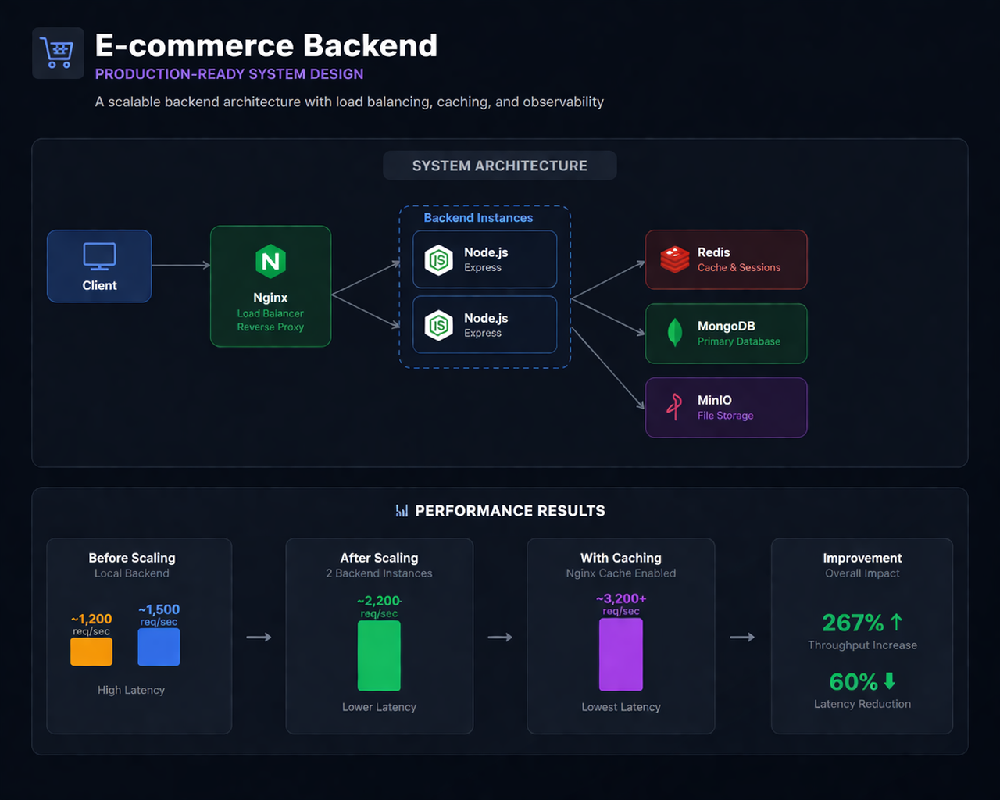

# 🛒 Production-Grade E-commerce Backend


A production-ready backend for an e-commerce platform, designed for **scalability, performance, and observability**.

---

## 🧱 System Design Overview

High-level architecture of the platform:



**Flow:** Client → Nginx → Backend instances → Redis → MongoDB → MinIO

---

## 🧠 Problem Statement

Most e-commerce backend demos stop at basic CRUD APIs and ignore real-world concerns like performance bottlenecks, horizontal scaling, and production monitoring.

This project focuses on building a **scalable and observable backend system** with caching, load distribution, and production-grade practices.

---

## ⚡ Key Features

* 🔐 Authentication (Access + Refresh Tokens)
* 🛡️ Role-Based Access Control
* 🛒 Products, Categories, Cart, Reviews
* 📂 File Uploads (MinIO - S3 compatible)
* 🚀 Redis Caching
* ⚖️ Nginx Load Balancing
* 📊 Metrics (Prometheus)
* 🧯 Error Tracking (Sentry)

---

## 📊 Observability

* 📈 Metrics: Prometheus
* 📊 Dashboard: Grafana
* 📜 Logs: Loki
* 🧯 Error Tracking: Sentry

---

## 🧪 Testing & Performance

### 🔹 1. Backend (Local Testing)

Run dependencies:

```bash
docker run -p 27017:27017 -d mongo
docker run -p 6379:6379 -d redis
docker run -p 9000:9000 -p 9001:9001 -d minio/minio server /data
```

Run backend:

```bash
npm install
npm run dev
```

Server runs on: `http://localhost:4000`

Baseline autocannon result (local backend, no containers):


---

### 🔹 2. Docker-based Testing (Load Distribution)

Run containers:

* Backend
* Nginx (without caching)
* MongoDB
* Redis
* MinIO

#### Single Instance:

```bash
docker compose up
```

#### Scaled Backend:

```bash
docker compose up --scale backend=2
```

Autocannon result after running backend in containers (load distributed via Nginx):


---

### 🔹 3. Load Testing (autocannon)

```bash
autocannon -c 200 -d 20 http://localhost/api/test/heavy
```

---

### 🔹 4. Nginx Config (No Cache Example)

```nginx
location /api/test/heavy {
    proxy_pass http://backend;
    proxy_cache off;
}
```

---

### 🔹 5. With Caching (Performance Optimization)

* Enable Nginx caching
* Compare latency and throughput
* Observe improvement

Before enabling Nginx cache (higher latency, lower throughput):


After enabling Nginx cache (improved latency and throughput):


---

## 📊 Performance Comparison

| Scenario                      | Requests/sec | Latency | Notes                         |
| ----------------------------- | ------------ | ------- | ----------------------------- |
| Local backend (no containers) | 1035         | Higher  | No load balancing             |
| Docker (single instance)      | XXXX         | Medium  | Containerized backend         |
| Scaled backend (2 instances)  | 1463         | Lower   | Load distributed via Nginx    |
| With Nginx caching            | 2880         | Lowest  | Cached responses, faster APIs |


## 📊 Performance Insights

* Improved throughput with backend scaling
* Reduced latency using caching
* Efficient request distribution via Nginx
* Tested under high concurrency (200 users)

---

## 🖼️ Observability Screenshots

Sentry error trace captured :


---

## 🛠️ Tech Stack

* Backend: Node.js, Express
* Database: MongoDB
* Cache: Redis
* Storage: MinIO
* Proxy: Nginx
* Monitoring: Prometheus, Grafana, Loki, Sentry
* Testing: Autocannon

---

## 🚀 Getting Started

```bash
git clone <repo-link>
docker compose up --build
```

---

## 📌 Key Learnings

* Designing scalable backend systems
* Load balancing and caching strategies
* Observability and monitoring
* Performance testing under real conditions
* Production-level backend practices

---

## 🤝 Contribution

Open for contributions and improvements.

---

## ⭐ Support

If you found this helpful, consider giving it a star ⭐
