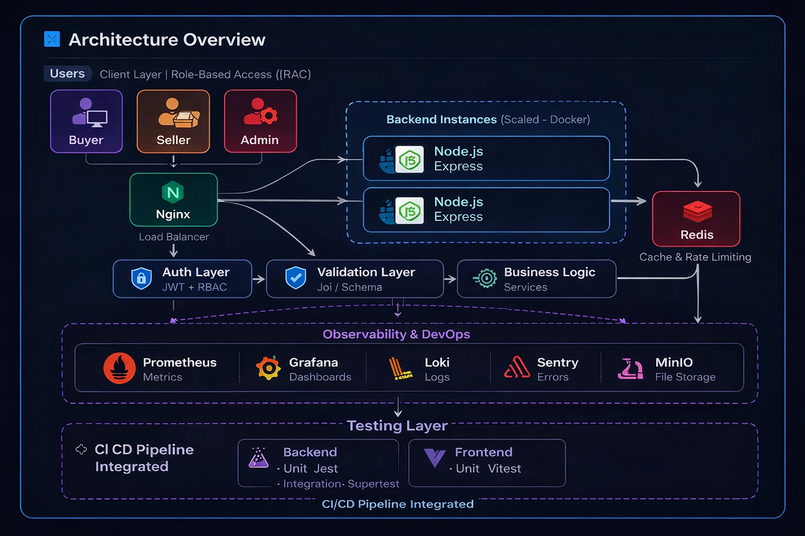

# 🚀 Scalable E‑Commerce System


A production‑ready full‑stack e‑commerce system designed with **scalability**, **performance**, and **observability** in mind.

---

## 📌 Overview

This project goes beyond a basic CRUD backend. It demonstrates how real‑world systems are built with:

* ⚖️ Load balancing and reverse proxy (Nginx)
* 🧩 Distributed backend services (Dockerized)
* 🚀 Caching layer (Redis)
* 📈 Observability (Prometheus, Grafana, Loki)
* ✅ End‑to‑end testing and CI/CD pipelines
* 🛡️ Rate limiting & advanced Node.js security (global + per‑API limits)

---
## 🚀 Core Features

A complete breakdown of user flows, seller workflows, and system-level capabilities is documented separately for better readability.

👉 📄 **[View Detailed Features](./FEATURE.md)**

Includes:
- User, Seller, and Admin workflows
- Product management, search, cart, wishlist
- Scalable backend architecture (cache, rate limiting, RBAC)
- System design-level features and future improvements

## 🏗️ System Architecture

This system is designed with a strong focus on **scalability, performance, and fault tolerance**.  
Key design challenges and the solutions implemented (caching, load balancing, service separation) are documented in detail.

👉 📄 **[View System Design Details](./SYSTEM_DESIGN.md)**

High-level architecture includes:
- Role-based access control (RBAC)
- Authentication & authorization middleware
- Request validation layer
- Layered architecture (Controller → Service → Repository)
- Redis caching layer
- Observability pipeline (Prometheus, Grafana, Loki)



---

## 🧩 Module Design

Each module in the system is designed with **separation of concerns and scalability in mind**.  

👉 📄 **[View Module Design Documentation](./MODULE_DESIGN.md)**

Covers:
- Module responsibilities and boundaries
- Design decisions and trade-offs
- Scalability considerations per module
- Reasoning behind architecture choices

## 🔄 Request Flow

1. 🌐 Client sends HTTP request ->Frontend
2. 🧭 Nginx (Caching some response mostly visited only ) forwards request to a backend instance 

3. 🛡️ Auth middleware Authnticate users --> / roles(Admin/iser/seller)
4. ✅ Validation layer checks request body / params
5. 🧠 Controller handle  req,res only 
6. Service do business login
7.Repository to interact with db only 
6. ⚡ Checks Redis cache; if miss, hits MongoDB
7. 📦 Response is returned back through Nginx to the client

Flow summary: `Client → Nginx → Backend → Auth → Validation → Controller -> service -> Repository→ Cache/DB → Response`

---

## 📂 Project Structure

```text
.
├── Backend/              # Node.js API, business logic, services
├── Front-end/            # React UI
├── nginx/                # Reverse proxy + load balancing configs
├── monitoring/           # Prometheus, Grafana, Loki setup
├── migrations/           # Database migrations
├── tests/                # E2E + integration tests (Playwright, etc.)
├── docker-compose.yml    # Local + prod‑like orchestration
├── docker-compose.ci.yml # CI/CD compose setup
└── README.md             # Root documentation
```

---

## 🔗 Module Documentation

To keep the project clean and modular, detailed documentation is separated:

* 🔧 **Backend (API + Business Logic)**
  👉 [Backend README](./Backend/readme.md)

* 🎨 **Frontend (UI + Client Logic)**
  👉 [Frontend README](./Front-end/README.md)

---

## ⚙️ Tech Stack

| Layer        | Tech                                      | Role                          |
| ------------ | ----------------------------------------- | ----------------------------- |
| 🧠 Backend   | Node.js (Express)                         | REST APIs, business logic     |
| 🎨 Frontend  | React                                     | SPA client, UI/UX             |
| 🗄️ Database  | MongoDB                                   | Persistent data store         |
| 🌐 Proxy     | Nginx                                     | Reverse proxy, load balancing |
| ⚡ Cache     | Redis                                     | Caching, sessions, hot data   |
| 📈 Monitoring| Prometheus, Grafana, Loki                 | Metrics, dashboards, logs     |
| 🧪 Testing   | Playwright, Jest, Supertest               | E2E, unit, integration tests  |
| ⚙️ DevOps    | Docker, CI/CD (GitHub Actions, AWS EC2)   | Containers, pipelines, deploy |

---

## 🐳 Getting Started

### 1. Prerequisites

- Docker & Docker Compose
- Node.js (for local development and running tests)
- Git

---

### 2. Quick start with Docker (recommended)

This starts MongoDB, Redis, MinIO, the backend API and Nginx (serving the built frontend).

```bash
# From project root

# 1) Configure backend Docker environment
cp Backend/.env.docker.example Backend/.env.docker
# On Windows PowerShell:
# Copy-Item Backend/.env.docker.example Backend/.env.docker

# 2) Build and start the stack
docker-compose up -d --build
```

#### Seed sample data (inside Docker backend container)

```bash
# From project root, after docker-compose is up
docker compose exec backend npm run seed
```

Then:

- App via Nginx: http://localhost
- Backend health: http://localhost/api/health

Example health check:

```bash
curl http://localhost/api/health
# {"message":"Server is OK","uptime":38.84134693,"timestamp":"3/28/2026, 11:55:43 AM"}
```

---

### 3. Backend development (local, without Docker)

```bash
cd Backend

# Create local env file
cp .env.example .env
# On Windows PowerShell:
# Copy-Item .env.example .env

npm install

# (Optional) Start dependencies with Docker
docker run -p 27017:27017 -d mongo
docker run -p 6379:6379 -d redis
docker run -p 9000:9000 -p 9001:9001 -d minio/minio server /data

# Seed sample data
npm run seed

# Start dev server
npm run dev
```

Backend runs on: http://localhost:4000

To run backend tests locally:

```bash
npm test
```

---

### 4. Frontend development (local)

```bash
cd Front-end

npm install

# Create .env and set at least:
# VITE_API_BASE_URL=http://localhost:4000
# (or your Nginx URL if running via Docker)

npm run dev
```

Frontend dev server runs on: http://localhost:5173

To run frontend tests:

```bash
npm test
```

---

## 🧪 Testing

```bash
# Full test suite (backend + frontend + e2e)
npm run test

# Backend tests only
npm run test:backend

# Frontend tests only
npm run test:frontend

# End-to-end tests
npm run test:e2e

# Integration tests
npm run test:integration
```

Includes:

* 🧪 End‑to‑end API + UI tests
* 🔍 Integration flows validated
* ⚙️ CI‑based test execution


---

## 📊 Performance

* 🚀 Load tested using **Autocannon**
* ⚖️ Nginx improves throughput via load balancing
* 🚄 Redis significantly reduces database latency
* 📉 Lower response times under concurrent load


## 📈 Observability

* 📊 Metrics → Prometheus
* 📉 Dashboards → Grafana
* 📜 Logs → Loki
* 🚨 Error tracking → Sentry

This setup ensures real‑time monitoring and debugging in production‑like environments.

---

## 🚀 Key Features

* 🔐 JWT authentication + role-based access control (Admin, Seller, Buyer)
* 🛡️ Request validation using Joi (schema-based validation)
* 🚦 Rate limiting (global + route-level)
* 🧱 Scalable backend architecture
* 🌐 Reverse proxy with load balancing
* ⚡ Redis caching layer
* 🐳 Full Dockerized environment
* 🔁 CI/CD-ready pipeline
* 📈 Observability (metrics + logs)
* 🧩 Clean, modular project structure


---

## 🔮 Future Improvements

* ☸️ Kubernetes deployment
* 🕵️ Distributed tracing (Jaeger)
* 🌍 CDN integration

---

## 🤝 Contributing

Happy to take ideas, bug reports, and small PRs.
If you spot something that can be improved, just open an issue or send a pull request.

---

## 👨‍💻 Author

**Deepak Kumar**  
Backend Engineer | Scalable Systems | DevOps & Observability
